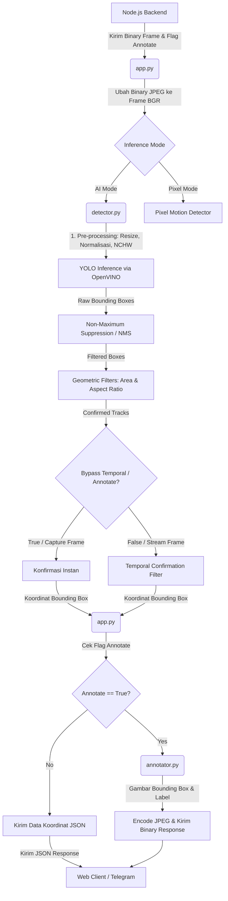

# Metodologi: Arsitektur Sistem dan Pipeline Deteksi Objek

Sistem deteksi objek manusia dirancang menggunakan arsitektur modular yang terbagi menjadi empat lapisan fungsional (*functional layers*), yaitu:
1. **Configuration Layer (`config.py`)** – Penyimpanan parameter terpusat.
2. **Integration & Communication Layer (`app.py`)** – Manajer komunikasi data real-time berbasis WebSocket.
3. **Inference & Filter Pipeline Layer (`detector.py`)** – Pengolah utama kecerdasan buatan (AI) dan pelacakan temporal.
4. **Visualization Layer (`annotator.py`)** – Penggambar bounding box dan teks informasi objek.

## 1. Diagram Alir Data (Data Flow)

Alur pemrosesan citra dari klien (ESP32-CAM via Node.js) hingga hasil akhir deteksi ditunjukkan pada diagram berikut:

---

## 2. Penjelasan Detail Komponen Pipeline

### A. Lapisan Konfigurasi (`config.py`)
Berfungsi sebagai *Single Source of Truth* (SSoT) untuk seluruh subsistem. Parameter yang diatur di sini menentukan sensitivitas model AI dan efisiensi pemrosesan perangkat keras. Hyperparameter penting meliputi:
* **Threshold Deteksi:** Batas minimal tingkat keyakinan model (`CONFIDENCE_THRESHOLD`) dan ambang batas tumpang-tindih kotak (`NMS_IOU_THRESHOLD`).
* **Geometric Filter:** Batas luas area kotak (`MIN_BOX_AREA`) dan batasan aspek rasio tinggi-lebar manusia (`MIN_ASPECT_RATIO` hingga `MAX_ASPECT_RATIO`) untuk menekan *false positives* yang disebabkan oleh noise lingkungan (misalnya hewan kecil atau bayangan).

### B. Lapisan Integrasi & Komunikasi (`app.py`)
Bertindak sebagai klien WebSocket berkinerja tinggi yang menghubungkan modul AI dengan gerbang backend Node.js. Tugas utamanya adalah:
* **Protokol Binary Parsing:** Menerima paket biner mentah (*raw binary packets*). Paket ini memiliki struktur khusus: **Header [ID Permintaan (4 byte) + Flag Anotasi (1 byte) + Panjang ID Perangkat (1 byte) + ID Perangkat (Variabel)] + Payload Citra JPEG**.
* **Manajemen Alur Kerja:** Mengubah biner JPEG menjadi matriks citra BGR OpenCV, kemudian secara kondisional mengarahkan gambar ke `detector.py` (untuk deteksi YOLO) atau pemrosesan Pixel Motion berbasis perbedaan frame (*frame differencing*).
* **Manajemen Memori:** Melakukan pembersihan RAM secara proaktif menggunakan modul `gc` (Garbage Collector) Python setelah setiap frame selesai diproses. Ini sangat penting untuk menjaga stabilitas memori jangka panjang ketika dideploy pada komputer berspesifikasi rendah seperti Raspberry Pi atau Mini PC.

### C. Lapisan Inferensi & Filtrasi AI (`detector.py`)
Komponen paling krusial yang mengimplementasikan kelas `PersonDetector`. Di dalam komponen ini terdapat sub-pipeline pemrosesan citra sebagai berikut:
1. **Akselerasi Perangkat Keras Dinamis:** Detektor secara otomatis memeriksa pustaka perangkat keras yang tersedia. Jika terdeteksi GPU/iGPU Intel, detektor mengompilasi model TensorFlow Lite (`best.tflite`) menggunakan mesin **Intel OpenVINO** untuk inferensi berkecepatan tinggi. Jika tidak ada, sistem akan turun (*fallback*) menggunakan interpreter LiteRT (TensorFlow Lite asli) atau Ultralytics.
2. **Pre-processing Citra:** Mengubah ruang warna frame dari BGR ke RGB, mengubah ukuran (*resize*) citra ke dimensi input model (misalnya 320x320), melakukan normalisasi nilai piksel ke rentang `[0.0, 1.0]`, dan melakukan transposisi bentuk tensor ke format *Channel-First* (NCHW).
3. **Pasca-Inferensi & Non-Maximum Suppression (NMS):** Membaca tensor keluaran model (baik berformat 6-channel End-to-End NMS-Free maupun standard YOLO), menyaring kelas target (indeks 0 untuk "Person"), dan menerapkan OpenCV DNN NMS untuk membuang kotak deteksi yang ganda/tumpang tindih pada objek yang sama.
4. **Penyaringan Geometris:** Memeriksa luas area absolut (`area`) dan rasio dimensi vertikal-horizontal (`aspect_ratio`). Jika kotak objek terlalu kecil atau bentuknya tidak menyerupai proporsi tubuh manusia (misalnya bayangan memanjang), objek akan diabaikan.
5. **Pelacak Temporal (Multi-Object Tracking):** Menggunakan pelacakan berbasis *Intersection over Union* (IoU) melintasi frame berurutan. Untuk video streaming real-time, objek baru dianggap valid jika muncul konsisten selama minimal $N$ frame berturut-turut untuk menghindari kedipan (*flickering*). Untuk pengambilan gambar tunggal (*capture/PIR upload*), logika ini dilewati (`bypass_temporal = True`) agar objek langsung terdeteksi pada frame pertama.

### D. Lapisan Anotasi (`annotator.py`)
Bertanggung jawab atas proses visualisasi akhir citra (*rendering layer*). 
* Fungsi `annotate_image` menerima matriks citra asli beserta koordinat kotak relatif dari detektor.
* Mengubah koordinat normalisasi `[0.0, 1.0]` kembali ke koordinat piksel absolut sesuai resolusi citra input.
* Menggambar kotak pembatas menggunakan fungsi `cv2.rectangle()` dengan warna RGB yang kontras (misal merah) dan ketebalan garis dinamis.
* Menulis label teks kelas beserta persentase tingkat keyakinan deteksi menggunakan font `cv2.FONT_HERSHEY_SIMPLEX` di atas bounding box.

---

## 3. Ringkasan Karakteristik Desain (Untuk Jurnal)

| Fitur | Deskripsi Teknis | Manfaat Akademis/Praktis |
| :--- | :--- | :--- |
| **Akselerasi Hardware** | Kompilasi model TFLite ke IR OpenVINO secara otomatis jika iGPU Intel terdeteksi. | Efisiensi komputasi tinggi pada perangkat *edge computing*. |
| **Penyaringan Multi-tahap** | Kombinasi NMS, filter luas area piksel, aspek rasio 2D, dan pelacakan temporal. | Menurunkan tingkat *False Positive Rate* (FPR) secara drastis pada kondisi luar ruangan. |
| **Protokol Biner Kustom** | Paket WebSocket menggunakan header terstruktur ukuran tetap (fixed-size). | Meminimalkan overhead transmisi jaringan untuk mencapai framerate tinggi (up to 20+ FPS). |
| **Bypass Temporal Dinamis** | Beralih otomatis antara pelacakan berbasis frame (untuk stream) dan konfirmasi instan (untuk capture). | Akurasi tinggi pada tangkapan snapshot tanpa mengorbankan stabilitas stream. |